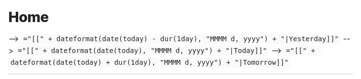

# move-cursor-on-startup
Obsidian plugin to move the cursor to the right and back to the left when starting up. 

Why? To keep DataView expressions from not running on the first load of, say, your Home file.

#### Problem Example:
This is what happens with DataView embedded in a Home note, or first note you open:

#### Solution Example
This is what happens once the cursor automaticall moves briefly on startup:

To contribute / modify this make use of the Obsidian docs: https://docs.obsidian.md/Plugins/Getting+started/Build+a+plugin

